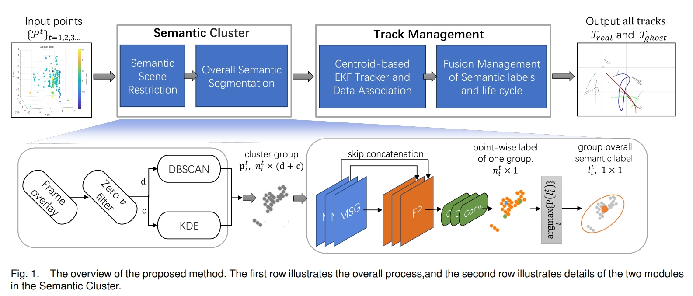
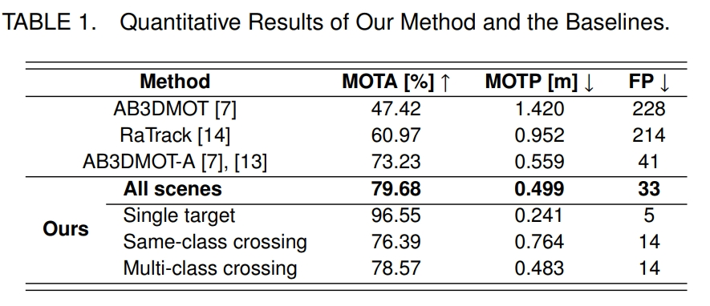

# SemanticTrack —— Enhanced Radar Detection: Semantic Cluster and Track Management for Ghost Suppression

## Table of Contents
- [Introduction](#introduction)
- [Environment](#Environment)
- [Code Overview](#code-overview)
- [Experimental Details](#experimental-details)
- [Results](#results)
- [Data Availability](#data-availability)

## Introduction
SemanticTrack is a novel target clustering and track management method that integrates semantic information from radar point clouds. We are the first to fully exploit these features by training ghost targets as a distinct class. Due to the lack of ghost target annotations in existing open-source datasets, we collected a dedicated dataset for our experiments. Results show that our method improves radar-based perception systems, enhancing tracking and ghost suppression in complex environments.

## Environment

Create a new conda environment using the provided `environment.yaml` file:

```bash
conda env create -f environment.yaml
```
This will setup a conda environment named **SemanticTrack** with Python 3.8, PyTorch 2.3.0.

## Method Overview



Due to [Data Availability](#data-availability) and AB3DMOT's repository license, we are currently only open-sourcing our method's code.
This repository contains the following key components:

- **main.py**: The main script that runs the entire pipeline of our proposed semantic fusion method.
- **SemanticSceneRestriction.py**: Semantic Scene Restriction. Fully utilize the spatial and semantic information provided by radar to form target point cloud groups.
- **Pointnet2.py**: Overall Semantic Segmentation model. Infer the semantic labels of the target point cloud groups.
- **MOT.py**: Track Management. Target identification and ghost suppression are made according to the semantic labels and life cycles of all tracks.

## Experimental Details

- **[docs/ImplementationDetails.pdf](docs/ImplementationDetails.pdf)**: This PDF provides a comprehensive description of the use of the experimental facilities.

## Results
Below are the results of qualitative comparison between our approach and the baselines in three representative scenes.The legend at the bottom of the image applies only to the results of our method (last row).


Below are the quantitative results of our method compared with the baselines across all scenes. Additionally, we have separately listed the results of three representative scenes.




## Data Availability

Currently, the data used in this project is subject to restrictions related to the collection site. As such, we are unable to release the dataset at this time. We are in the process of obtaining permission from the experimental site provider, and once the necessary approvals are granted, we will release the dataset as open source. 


